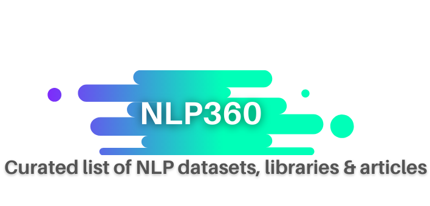

   
   
  <a href="#Datasets"><b>Datasets</b></a> |
  <a href="#NLP-Libraries"><b>Libraries</b></a> |
  <a href="#Articles"><b>Articles</b></a>

## Datasets

- [Complete NLP Dataset by The Eye](https://the-eye.eu/public/AI/pile_preliminary_components/) - ArXiv (37GB), PubMed (6GB), StackExchange (34GB), OpenWebText (27GB), Github (106GB)

- [The Big Bad NLP Database](https://datasets.quantumstat.com/) - Added the CommonCrawl datasets to the Big Bad NLP Database

- [CommonCrawl by Facebook](http://data.statmt.org/cc-100/) - Facebook release CommonCrawl dataset of 2.5TB of clean unsupervised text from 100 languages

- [Wikipedia Data](https://github.com/placemarkt/wiki_coordinates) - CSV file containing the Wikidata id, title, lat/lng coordinates, and short description for all Wikipedia articles with location data (updated)

- [Datasets by Transformers](https://github.com/huggingface/datasets) - Datasets and evaluation metrics for natural language processing by Transformers. Compatible with NumPy, Pandas, PyTorch and TensorFlow

- [Multidomain Sentiment Analysis Dataset](http://www.cs.jhu.edu/~mdredze/datasets/sentiment/) - This is a slightly older dataset that features a variety of product reviews taken from Amazon.

- [IMDB Reviews](http://ai.stanford.edu/~amaas/data/sentiment/) - Featuring 25,000 movie reviews, this relatively small dataset was compiled primarily for binary sentiment classification use cases.
- [Stanford Sentiment Treebank](http://nlp.stanford.edu/sentiment/code.html) - Also built from movie reviews, Stanford’s dataset was designed to train a model to identify sentiment in longer phrases. It contains over 10,000 snippets taken from Rotten Tomatoes.
- [Sentiment140](http://help.sentiment140.com/for-students/) - This popular dataset contains 160,000 tweets formatted with 6 fields: polarity, ID, tweet date, query, user, and the text. Emoticons have been pre-removed.
- [Twitter US Airline Sentiment](https://www.kaggle.com/crowdflower/twitter-airline-sentiment) - Scraped in February 2015, these tweets about US airlines are classified as classified as positive, negative, and neutral. Negative tweets have also been categorized by reason for complaint.

- [20 Newsgroups](http://qwone.com/~jason/20Newsgroups/) - This collection of approximately 20,000 documents covers 20 different newsgroups, from baseball to religion.

- [ArXiv](http://arxiv.org/help/bulk_data_s3) - This repository contains all of the arXiv research paper archive as fulltext, with a total dataset size of 270 GB. 
- [Reuters News Dataset](https://archive.ics.uci.edu/ml/datasets/Reuters-21578+Text+Categorization+Collection) - The documents in this dataset appeared on Reuters in 1987. They have since been assembled and indexed for use in machine learning.
- [The WikiQA Corpus](http://research.microsoft.com/apps/mobile/download.aspx?p=4495da01-db8c-4041-a7f6-7984a4f6a905) - This corpus is a publicly-available collection of question and answer pairs. It was originally assembled for use in research on open-domain question answering.
- [UCI’s Spambase](https://archive.ics.uci.edu/ml/datasets/Spambase) - Originally created by a team at Hewlett-Packard, this large spam email dataset is useful for developing personalized spam filters.
- [Yelp Reviews](https://www.yelp.com/dataset) - This open dataset released by Yelp contains more than 5 million reviews.
- [WordNet](https://wordnet.princeton.edu/) - Compiled by researchers at Princeton University, WordNet is essentially a large lexical database of English ‘synsets’, or groups of synonyms that each describe a different, distinct concept.
- [The Blog Authorship Corpus](http://u.cs.biu.ac.il/~koppel/BlogCorpus.htm) – This dataset includes over 681,000 posts written by 19,320 different bloggers. In total, there are over 140 million words within the corpus.
- [Enron Dataset](https://www.cs.cmu.edu/~./enron/) - Over half a million anonymized emails from over 100 users. It’s one of the few publically available collections of “real” emails available for study and training sets.
- [Project Gutenberg](http://www.gutenberg.org/wiki/Gutenberg:Offline_Catalogs) - Extensive collection of book texts. These are public domain and available in a variety of languages, spanning a long period of time.

 

## NLP Libraries

- [Haystack](https://github.com/deepset-ai/haystack) - Open-source framework for building end-to-end question answering systems for large document collections. 

- [AdaptNLP](https://github.com/Novetta/adaptnlp) - Powerful NLP toolkit built on top of Flair and Transformers for running, training and deploying state of the art deep learning models. Unified API for end to end NLP tasks: Token tagging, Text Classification, Question Anaswering, Embeddings, Translation, Text Generation etc.

- [Sentence-Transformers](https://github.com/UKPLab/sentence-transformers) - Python package to compute the dense vector representations of sentences or paragraphs using SOTA pretrained Transformers models.

- [Tweet-Preprocessor](https://github.com/s/preprocessor) -  Python library to clean text/tweets in a single line of code.

- [SimpleTransformers](https://github.com/ThilinaRajapakse/simpletransformers) -  Simple library to build any NLP deep learning models in 3 lines of code. It packs all the powerful features of Huggingface’s transformers in just 3 lines of code for end to end NLP tasks.

- [TextAttack](https://github.com/QData/TextAttack) - Adversarial attacks, adversarial training, and data augmentation in NLP

- [Fast.ai](https://github.com/fastai/fastai) - Super high-level abstractions and easy implementations for NLP data preprocessing, model construction, training, and evaluation. 

- [TorchText](https://github.com/pytorch/text) - Convenient data processing utilities to process and prepare them in batches before you feed them into your deep learning framework

- [OpenNMT](https://github.com/OpenNMT/OpenNMT-py) - Convenient and powerful tool for the machine translation and sequence learning tasks

- [ParlAI](https://github.com/facebookresearch/ParlAI) - Task-Oriented Dialogue, Chit-chat Dialogue, Visual Question Answering

- [DeepPavlov](https://github.com/deepmipt/DeepPavlov) - Framework mainly for chatbots and virtual assistants development, as it provides all the environment tools necessary for a production-ready and industry-grade conversational agent

- [TextBlob](http://textblob.readthedocs.org/) - Providing a consistent API for diving into common natural language processing (NLP) tasks. Stands on the giant shoulders of [Natural Language Toolkit (NLTK)](https://www.nltk.org/) and [Pattern](https://github.com/clips/pattern), and plays nicely with both :+1:
- [spaCy](https://github.com/explosion/spaCy) - Industrial strength NLP with Python and Cython :+1:
- [textacy](https://github.com/chartbeat-labs/textacy) - Higher level NLP built on spaCy
- [gensim](https://radimrehurek.com/gensim/index.html) - Python library to conduct unsupervised semantic modelling from plain text :+1:
- [scattertext](https://github.com/JasonKessler/scattertext) - Python library to produce d3 visualizations of how language differs between corpora
- [GluonNLP](https://github.com/dmlc/gluon-nlp) - A deep learning toolkit for NLP, built on MXNet/Gluon, for research prototyping and industrial deployment of state-of-the-art models on a wide range of NLP tasks.
- [AllenNLP](https://github.com/allenai/allennlp) - An NLP research library, built on PyTorch, for developing state-of-the-art deep learning models on a wide variety of linguistic tasks.
- [PyTorch-NLP](https://github.com/PetrochukM/PyTorch-NLP) - NLP research toolkit designed to support rapid prototyping with better data loaders, word vector loaders, neural network layer representations, common NLP metrics such as BLEU
- [Rosetta](https://github.com/columbia-applied-data-science/rosetta) - Text processing tools and wrappers (e.g. Vowpal Wabbit)
- [PyNLPl](https://github.com/proycon/pynlpl) - Python Natural Language Processing Library. General purpose NLP library for Python. Also contains some specific modules for parsing common NLP formats, most notably for [FoLiA](https://proycon.github.io/folia/), but also ARPA language models, Moses phrasetables, GIZA++ alignments.
- [PySS3](https://github.com/sergioburdisso/pyss3) - Python package that implements a novel white-box machine learning model for text classification, called SS3. Since SS3 has the ability to visually explain its rationale, this package also comes with easy-to-use interactive visualizations tools ([online demos](http://tworld.io/ss3/)).
- [jPTDP](https://github.com/datquocnguyen/jPTDP) - A toolkit for joint part-of-speech (POS) tagging and dependency parsing. jPTDP provides pre-trained models for 40+ languages.
- [BigARTM](https://github.com/bigartm/bigartm) - a fast library for topic modelling
- [Snips NLU](https://github.com/snipsco/snips-nlu) - A production ready library for intent parsing
- [Chazutsu](https://github.com/chakki-works/chazutsu) - A library for downloading&parsing standard NLP research datasets
- [Word Forms](https://github.com/gutfeeling/word_forms) - Word forms can accurately generate all possible forms of an English word
- [Multilingual Latent Dirichlet Allocation (LDA)](https://github.com/ArtificiAI/Multilingual-Latent-Dirichlet-Allocation-LDA) - A multilingual and extensible document clustering pipeline
- [NLP Architect](https://github.com/NervanaSystems/nlp-architect) - A library for exploring the state-of-the-art deep learning topologies and techniques for NLP and NLU
- [Flair](https://github.com/zalandoresearch/flair) - A very simple framework for state-of-the-art multilingual NLP built on PyTorch. Includes BERT, ELMo and Flair embeddings.
- [Kashgari](https://github.com/BrikerMan/Kashgari) - Simple, Keras-powered multilingual NLP framework, allows you to build your models in 5 minutes for named entity recognition (NER), part-of-speech tagging (PoS) and text classification tasks. Includes BERT and word2vec embedding.
- [FARM](https://github.com/deepset-ai/FARM) - FARM makes cutting-edge transfer learning simple and helps you to leverage pretrained language models for your own NLP tasks.
- [Rita DSL](https://github.com/zaibacu/rita-dsl) - a DSL, loosely based on [RUTA on Apache UIMA](https://uima.apache.org/ruta.html). Allows to define language patterns (rule-based NLP) which are then translated into [spaCy](https://spacy.io/), or if you prefer less features and lightweight - regex patterns.
- [Transformers](https://github.com/huggingface/transformers) - Natural Language Processing for TensorFlow 2.0 and PyTorch.
- [Tokenizers](https://github.com/huggingface/tokenizers) - Tokenizers optimized for Research and Production.
- [fairSeq](https://github.com/pytorch/fairseq) Facebook AI Research implementations of SOTA seq2seq models in Pytorch. 
- [corex_topic](https://github.com/gregversteeg/corex_topic) - Hierarchical Topic Modeling with Minimal Domain Knowledge  

 

## Articles

- [Top 10 Most Useful But Underrated Python Libraries for Data Science](https://shivanandroy.com/top-useful-but-underrated-python-libraries-for-data-science/)

- [Building A Faster & Accurate COVID Search Engine with Transformers🤗](https://shivanandroy.com/building-a-faster-accurate-covid-search-engine-with-transformers/)
- [Fine Tuning XLNet Model for Text Classification](https://shivanandroy.com/fine-tuning-xlnet-model-for-text-classification/)
- [Building Question Answering Model at Scale using 🤗Transformers](https://shivanandroy.com/transformers-building-question-answers-model-at-scale/)
- [Training a T5 Transformer Model - Generating Titles from ArXiv Paper's Abstracts using 🤗Transformers](https://shivanandroy.com/transformers-generating-arxiv-papers-title-from-abstracts/)
- [ResumeAnalyzer | An Easy Solution to Rank Resumes using Spacy](https://shivanandroy.com/resume-analyzer/)
- [Code📝: Fine Tune BERT Model for Binary Text Classification](https://shivanandroy.com/fine-tune-bert-for-binary-text-classification/)
- [Why Do We Need Activation Functions?](https://shivanandroy.com/why-do-we-need-activation-functions/)
- [Let's pay some Attention!](https://www.datamuni.com/@ShambhaviCodes/let-s-pay-some-attention)
- [A long-term Data Science roadmap which WON’T help you become an expert in only several months](https://www.datamuni.com/@Artgor/a-long-term-data-science-roadmap-which-won-t-help-you-become-an-expert-in-only-several-months)
